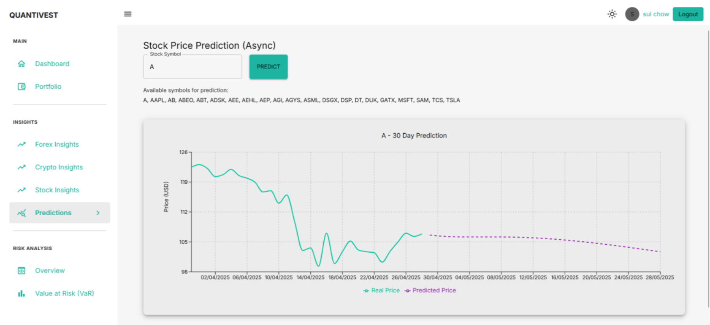
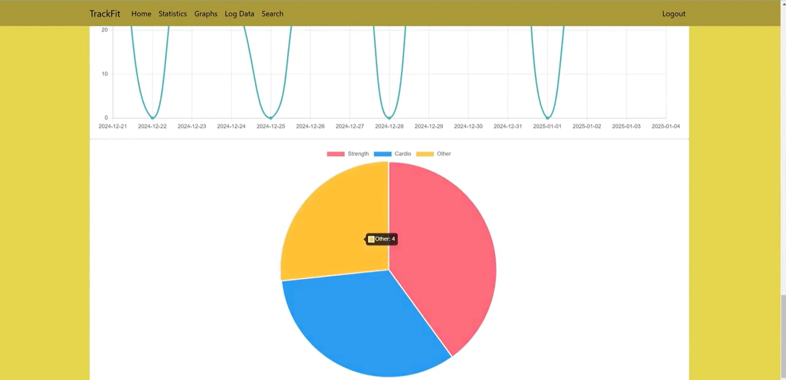

# Sulayman Chowdhury
*Aspiring Software Developer & Data Scientist*

A driven and detail-oriented Computer Science graduate with hands-on experience building full-stack applications and data-driven solutions. Passionate about using technology to solve complex problems.

[**Email**](mailto:sulaymanchowdhury1@gmail.com) &nbsp;&nbsp;•&nbsp;&nbsp; [**LinkedIn**](https://linkedin.com/in/suly45) &nbsp;&nbsp;•&nbsp;&nbsp; [**GitHub**](https://github.com/Sulayman-455)

---

### Featured Projects

---

### Quantivest - Financial Forecasting & Risk Dashboard
*Dissertation Project • Achieved 77% (First Class)*

A full-stack financial analysis dashboard built with Python and the MERN stack. The application provides real-time portfolio management, trend visualization, and integrates a machine learning model for stock forecasting.

[**Watch the Live Demo →**](https://youtu.be/JR6rff1yQLg)

**Technologies Used:** Python, React, Node.js, Express.js, MongoDB, JWT, Chart.js

---

### TrackFit - Cloud-Based Fitness App
*Cloud Computing Project • Achieved 88% (First Class)*

A full-stack fitness tracking application developed in a team and deployed on Google Cloud. My primary role was leading the development of the entire frontend user experience, while also contributing to the backend.

[**Watch the Live Demo →**](https://youtu.be/lKsIR0NrnqA)

**Technologies Used:** Python, Flask, HTML/CSS, JavaScript, Google Cloud, Docker, Chart.js

---
