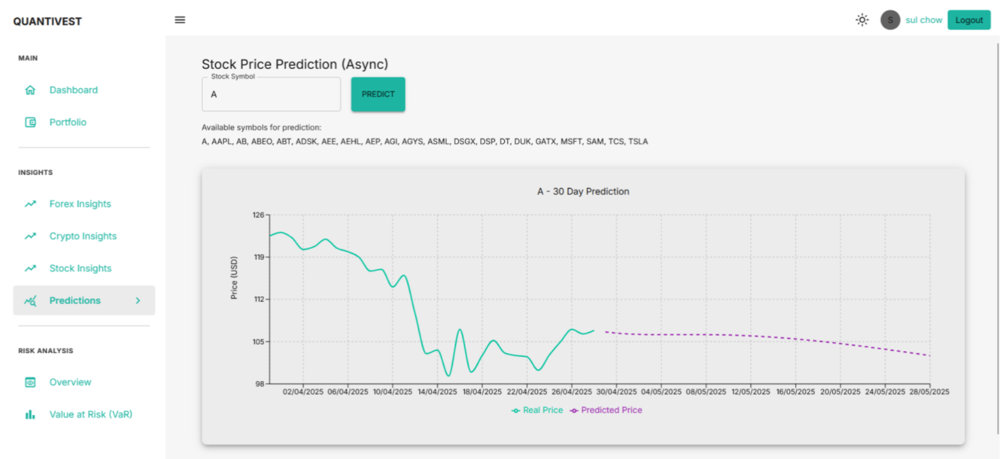
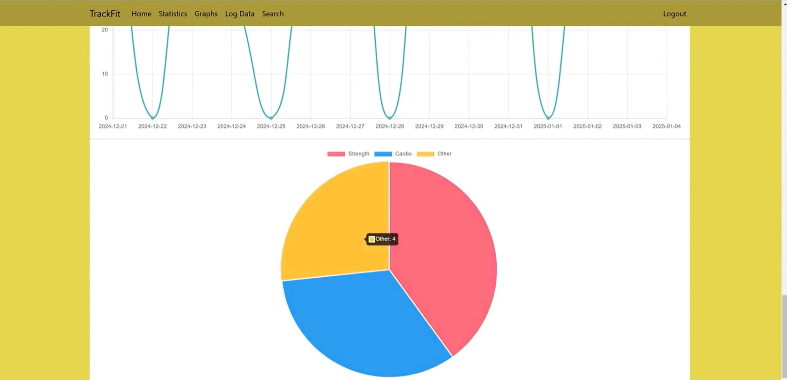

---
layout: default
title: Sulayman Chowdhury | Portfolio
---

# Sulayman Chowdhury
*Aspiring Risk & Data Analyst*

A driven and detail-oriented Computer Science graduate with hands-on experience building full-stack applications and data-driven solutions. Passionate about using technology to solve complex problems in the financial sector.

[**Email**](mailto:sulaymanchowdhury1@gmail.com) &nbsp;&nbsp;•&nbsp;&nbsp; [**LinkedIn**](https://linkedin.com/in/suly45) &nbsp;&nbsp;•&nbsp;&nbsp; [**GitHub**](https://github.com/Sulayman-455)

---

### Featured Projects

---

### Olist E-Commerce Analysis & Prediction
*Portfolio Project • In Progress*

An end-to-end analytics pipeline using Python and SQL to ingest and clean raw data, segment customers via RFM analysis, and train a Random Forest model (85% accuracy) to predict negative reviews. Key insights and model drivers are deployed to an interactive Power BI dashboard.

[**View the Project on GitHub →**](https://github.com/Sulayman-455/Olist-ECommerce-Analysis)

**Technologies Used:** Python (Pandas, Scikit-Learn), SQL (SQLite), Power BI, Git

  <!-- You will need to add a screenshot for this later -->

---

### Quantivest - Financial Forecasting & Risk Dashboard
*Dissertation Project • Achieved 77% (First Class)*

A full-stack financial analysis dashboard built with Python and the MERN stack. The application provides portfolio management and integrates a stacked LSTM model for stock forecasting and risk metric calculation (VaR, CVaR).

[**View the Project on GitHub →**](https://github.com/Sulayman-455/Quantivest-Project-Repo) <!-- Replace with your actual repo link -->

**Technologies Used:** Python, MongoDB, Express.js, React, Node.js, Redux, JWT, Pytest, Jest

---

### TrackFit - Cloud-Based Fitness App
*Cloud Computing Project • Achieved 88% (First Class)*

A full-stack fitness tracking application developed in a team. My primary role was leading frontend development (HTML/CSS/JS) and contributing to the Python/Flask backend.

[**View the Project on GitHub →**](https://github.com/Sulayman-455/TrackFit-Project-Repo) <!-- Replace with your actual repo link -->

**Technologies Used:** Python, Flask, HTML/CSS, JavaScript, Google Cloud, Docker, MySQL, Chart.js

---
### Certifications

---

---
